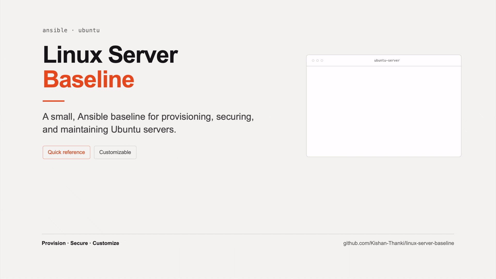

# Linux Server Baseline

> A small, Ubuntu-focused Ansible server baseline for quick, repeatable provisioning, security, and maintenance.

<p align="center">
  <a href="./media/card.html">
    
  </a>
</p>

A small, reusable starting point for developers, and anyone who wants a quick, repeatable Ubuntu server setup without building a full enterprise hardening framework.

Start with the defaults, understand what they change, and customize the roles and variables to fit your environment.

This repository provides a reusable server baseline covering system administration, SSH security, firewalling, basic SSH abuse mitigation, logging, auditing, kernel hardening, automatic security updates, swap, and basic operational tooling.

The project is intentionally modular. Individual components can be applied independently, while:

```text
playbooks/01-setup/baseline.yml
```

provides the primary entry point for the core server baseline.

The repository is designed to be **Ubuntu-only and cloud-provider agnostic**. It does not embed OCI-, AWS-, Azure-, GCP-, or other provider-specific implementation details.

Deployment-related identities and application services are kept outside the core server baseline.

> **Educational scope:** This project is a practical learning reference and a small, reusable starting point. It is intentionally opinionated and does not attempt to implement every possible production or compliance requirement.

## What This Project Configures

The core baseline can configure:

* Ubuntu package updates.
* A permanent `sysadmin` account.
* A permanent `automation` account.
* Key-based SSH hardening.
* `firewalld`.
* Basic SSH abuse mitigation with Fail2ban.
* Chrony time synchronization.
* Persistent journald logging.
* Auditd.
* Selected kernel and network hardening.
* Automatic security updates.
* Swap.
* Sysstat.
* A minimal initial webroot.

Deployment-specific functionality is separated under:

```text
playbooks/02-deployment/
```

Optional services are separated under:

```text
playbooks/03-services/
```

## Quick Start

For a typical Ubuntu server, the basic workflow is:

```text
Configure inventory
        ↓
Configure SSH public-key files
        ↓
Install Ansible dependencies
        ↓
Review with --check --diff
        ↓
Run the core baseline
        ↓
Verify access
        ↓
Customize or add deployment/services as needed
```

Install the development tools:

```bash
python -m pip install -r requirements-dev.txt
```

Install the pinned Ansible collections:

```bash
ansible-galaxy collection install \
  -r requirements.yml \
  -p .ansible/collections
```

Configure:

```text
inventory/inventory.ini
```

and the required SSH public-key file variables.

Review the proposed changes:

```bash
ansible-playbook \
  playbooks/01-setup/baseline.yml \
  --check --diff
```

Apply the core baseline:

```bash
ansible-playbook playbooks/01-setup/baseline.yml
```

The repository is designed to provide sensible defaults while remaining customizable. Review and adjust role defaults and host variables when your server has requirements outside the default configuration.

## Repository Structure

```text
linux-server-baseline/
├── LICENSE
├── README.md
├── ansible.cfg
├── inventory/
│   ├── host_vars/
│   │   ├── server-01.yml
│   │   └── server-02.yml
│   └── inventory.ini
├── playbooks/
│   ├── 01-setup/
│   │   ├── 01-system-update.yml
│   │   ├── 02-system-admin.yml
│   │   ├── 03-automation-user.yml
│   │   ├── 04-ssh-hardening.yml
│   │   ├── 05-firewall.yml
│   │   ├── 06-fail2ban.yml
│   │   ├── 07-ntp.yml
│   │   ├── 08-journald.yml
│   │   ├── 09-auditd.yml
│   │   ├── 10-sysctl.yml
│   │   ├── 11-auto-updates.yml
│   │   ├── 12-swap.yml
│   │   ├── 13-sysstat.yml
│   │   ├── 14-webroot.yml
│   │   ├── 99-remove-default-user.yml
│   │   └── baseline.yml
│   ├── 02-deployment/
│   │   └── 01-deployer-user.yml
│   └── 03-services/
│       └── caddy.yml
├── requirements-dev.txt
├── requirements.yml
├── roles/
│   ├── auditd/
│   ├── auto_updates/
│   ├── automation_user/
│   ├── caddy/
│   ├── deployer_user/
│   ├── fail2ban/
│   ├── firewall/
│   ├── journald/
│   ├── ntp/
│   ├── remove_default_user/
│   ├── ssh_hardening/
│   ├── swap/
│   ├── sysctl/
│   ├── sysstat/
│   ├── system_admin/
│   ├── system_update/
│   └── webroot/
└── scripts/
    └── validate-ansible.sh
```

## Requirements

### Target Server

* Ubuntu.
* Python 3.
* SSH access with an initial account capable of using `sudo`.
* Network connectivity to the configured Ubuntu package repositories.

The reusable roles in this repository currently target Ubuntu only.

### Control Machine

* Python 3.11.
* Ansible.
* Ansible Lint.
* OpenSSH client.
* Access to the target servers using the configured SSH key files.

The Ansible and Ansible Lint versions used for local validation and CI are pinned in:

```text
requirements-dev.txt
```

Using the pinned development dependencies helps keep local and CI validation consistent.

## Ansible Dependencies

The repository uses two dependency files.

### Ansible Collections

External Ansible collections are pinned in:

```text
requirements.yml
```

Current versions:

```yaml
---
collections:
  - name: ansible.posix
    version: "2.2.2"
  - name: community.general
    version: "13.2.0"
```

Install the pinned collections into the repository-local collection directory:

```bash
ansible-galaxy collection install \
  -r requirements.yml \
  -p .ansible/collections
```

The repository's `ansible.cfg` configures Ansible to search that local collection path.

### Development and CI Tools

Ansible and Ansible Lint are pinned in:

```text
requirements-dev.txt
```

Install them with:

```bash
python -m pip install -r requirements-dev.txt
```

These dependencies are used by local development and GitHub Actions validation.

## Configure the Inventory

The repository includes an example inventory at:

```text
inventory/inventory.ini
```

Because this is a public repository, it should contain placeholder values rather than production endpoints or credentials.

Example:

```ini
[servers]
server-01 ansible_host=YOUR_SERVER_HOSTNAME ansible_user=YOUR_INITIAL_USER
server-02 ansible_host=YOUR_SERVER_HOSTNAME ansible_user=YOUR_INITIAL_USER
```

The initial connection user must exist on a newly provisioned server and have sufficient privileges to perform the bootstrap.

After the permanent `automation` account has been established, recurring Ansible management should use:

```ini
ansible_user=automation
```

## Configure SSH Public Key Files

The core baseline creates two permanent management identities:

```text
sysadmin
automation
```

Each identity uses its own public SSH key.

The corresponding variables expect **paths to public-key files on the Ansible control machine**.

They do **not** contain the public-key text itself.

Example:

```yaml
system_admin_ssh_public_key_file: "/home/YOUR_USER/.ssh/id_ed25519.pub"
automation_user_ssh_public_key_file: "/home/YOUR_USER/.ssh/id_ed25519_automation.pub"
```

If deployment is enabled separately, the `deployer` identity can use its own public-key file:

```yaml
deployer_user_ssh_public_key_file: "/home/YOUR_USER/.ssh/id_ed25519_deployer.pub"
```

For example, your control machine may contain:

```text
~/.ssh/id_ed25519.pub
~/.ssh/id_ed25519_automation.pub
~/.ssh/id_ed25519_deployer.pub
```

The public key files are read by Ansible on the **control machine** and installed into the appropriate user's `authorized_keys` file on the target server.

> **Important:** Variables ending in `_file` refer to public-key file paths on the Ansible control machine. They do not contain public-key contents.

Before running a playbook that uses a key, make sure the corresponding public key file exists and is readable by the user running Ansible.

> **Do not use your private SSH key here.** Only the `.pub` public-key files should be referenced.

### Example Host Variables

For the core baseline:

```yaml
---
# Public key file for the human administrator.
system_admin_ssh_public_key_file: "/home/YOUR_USER/.ssh/id_ed25519.pub"

# Public key file for automated Ansible / CI access.
automation_user_ssh_public_key_file: "/home/YOUR_USER/.ssh/id_ed25519_automation.pub"
```

For deployment, configure the deployer key when using:

```text
playbooks/02-deployment/01-deployer-user.yml
```

For example:

```yaml
---
deployer_user_ssh_public_key_file: "/home/YOUR_USER/.ssh/id_ed25519_deployer.pub"
```

## Verify the Inventory

From the repository root:

```bash
ansible-inventory -i inventory/inventory.ini --graph
```

Test connectivity:

```bash
ansible servers -m ping
```

Inspect a specific host:

```bash
ansible-inventory -i inventory/inventory.ini --host server-01
```

## Applying the Core Baseline

Always review the proposed changes before applying the baseline to production infrastructure:

```bash
ansible-playbook \
  playbooks/01-setup/baseline.yml \
  --check --diff
```

> `--check --diff` is useful for reviewing intended changes, but it is not a substitute for testing the actual resulting server state.

Apply the core baseline:

```bash
ansible-playbook playbooks/01-setup/baseline.yml
```

The baseline is designed to be idempotent. After a server has converged, a subsequent check should normally report no changes unless packages or other declared state have changed externally.

## Baseline Architecture

The core baseline is organized into ordered setup playbooks.

### Phase 1: System Update and Access Provisioning

```text
01-system-update.yml
02-system-admin.yml
03-automation-user.yml
```

This phase:

* Updates Ubuntu packages.
* Reboots when the system requires it.
* Creates the permanent `sysadmin` account.
* Creates the permanent `automation` account.
* Installs the configured SSH public keys for those accounts.

### Phase 2: Security and Hardening

```text
04-ssh-hardening.yml
05-firewall.yml
06-fail2ban.yml
07-ntp.yml
08-journald.yml
09-auditd.yml
10-sysctl.yml
```

This phase establishes:

* SSH hardening.
* `firewalld` host protection.
* Basic SSH abuse mitigation with Fail2ban.
* Chrony time synchronization.
* Persistent journald logging.
* Linux audit rules.
* Kernel and network hardening.

### Phase 3: Operations and Maintenance

```text
11-auto-updates.yml
12-swap.yml
13-sysstat.yml
14-webroot.yml
```

This phase configures:

* Automatic security updates.
* Persistent swap.
* Local system performance accounting.
* A minimal initial webroot.

### Bootstrap User Cleanup

```text
99-remove-default-user.yml
```

Bootstrap-user cleanup is intentionally a **separate manual step**.

It is **not included in**:

```text
playbooks/01-setup/baseline.yml
```

This prevents the baseline from automatically removing the initial cloud/provider account before the user has verified that the permanent management accounts work correctly.

After verifying permanent management access, run:

```bash
ansible-playbook playbooks/01-setup/99-remove-default-user.yml
```

## Deployment

Deployment-related identities are intentionally kept separate from the generic server baseline.

The current deployment component provisions:

```text
deployer
```

as a non-privileged operational identity.

Run it explicitly:

```bash
ansible-playbook playbooks/02-deployment/01-deployer-user.yml
```

The `deployer` account:

* Has its own home directory.
* Uses the configured shell.
* Uses a dedicated SSH public key.
* Has its password locked.
* Is not a member of `sudo`.
* Does not receive a sudoers rule.

The deployment playbook creates the user and installs its authorized SSH public key. The deployment playbook also updates the SSH `AllowUsers` policy so that
the `deployer` account can connect using its configured public key.

The deployment layer does not install a complete application deployment engine or define application-specific release workflows.

It provides a separate operational identity that deployment tooling can use later.

## Bootstrap User Lifecycle

A typical lifecycle is:

```text
New Ubuntu server
        ↓
Initial bootstrap account
        ↓
Run 01-setup/baseline.yml
        ↓
sysadmin + automation created
        ↓
SSH / firewall / logging / security configuration
        ↓
Verify permanent management access
        ↓
Optionally run 02-deployment/01-deployer-user.yml
        ↓
Optionally run 99-remove-default-user.yml
```

The cleanup role currently targets the default Ubuntu bootstrap account:

```text
ubuntu
```

Before removing it, verify that the permanent management account works.

At minimum:

```bash
ansible server-01 -m ping
ansible server-02 -m ping
```

using the intended permanent Ansible account.

## Core Security Controls

### Least Privilege

The project separates administrative, automation, and deployment responsibilities:

```text
sysadmin
    Human administrative access.

automation
    Ansible, CI, and other automated management access.

deployer
    Optional non-privileged deployment operations.
```

The `deployer` identity is deliberately outside the core administrative baseline.

### Key-Based SSH Administration

The baseline uses key-based SSH authentication and disables direct root SSH access and password-based authentication.

The default SSH hardening includes:

```text
PermitRootLogin no
PasswordAuthentication no
KbdInteractiveAuthentication no
PubkeyAuthentication yes
X11Forwarding no
MaxAuthTries 3
```

The core baseline allows the current Ansible connection user together with the permanent management accounts.

The optional `deployer` account should only be included in SSH access when deployment setup is enabled and the account is configured appropriately.

These settings are intentionally **conservative and opinionated** for a small Ubuntu server baseline.

They are **not universally correct for every Linux workload**. Systems using VPNs, advanced routing, multihoming, centralized authentication, X11 forwarding, bastion-style configurations, or other specialized SSH workflows may require different settings.

Review and adjust the SSH role defaults when the target server has requirements outside the project's intended use case.

### Firewall

The host firewall uses:

```text
firewalld
```

The default public-zone baseline currently allows:

```text
22/tcp
80/tcp
443/tcp
```

These defaults are intentionally opinionated.

Port `22/tcp` is required for normal SSH administration.

Ports `80/tcp` and `443/tcp` are opened by default to make the baseline convenient for common learner and individual-developer scenarios where the server will quickly be used for a web application, reverse proxy, or Caddy.

This is a **convenience-oriented default**, not a claim that every server requires HTTP and HTTPS access.

If a server does not need web traffic, the allowed ports can be reduced through the firewall role configuration.

For example:

```yaml
firewall_allowed_ports:
  - "22/tcp"
```

Unnecessary services such as:

```text
dhcpv6-client
cockpit
```

are disabled.

### Legacy iptables Configuration

The baseline uses:

```text
firewalld
```

as the host firewall authority.

If the target server already contains persistent legacy iptables configuration, the baseline **does not remove it by default**.

The firewall role checks for:

```text
/etc/iptables/rules.v4
```

and, when detected, displays a warning.

The default setting is:

```yaml
firewall_remove_legacy_iptables: false
```

After reviewing the existing firewall rules, a user who intentionally wants to migrate from `iptables-persistent` / `netfilter-persistent` to firewalld can explicitly enable:

```yaml
firewall_remove_legacy_iptables: true
```

When enabled, the role:

* Stops and disables `netfilter-persistent`.
* Flushes the legacy IPv4 `INPUT` chain.
* Flushes the legacy IPv4 `FORWARD` chain.
* Removes `iptables-persistent`.
* Removes `netfilter-persistent`.
* Removes the persistent IPv4 and IPv6 iptables rules files.

> **Warning:** Enabling legacy iptables removal can change existing firewall behavior and may affect network access. Review the existing rules before enabling it, especially on an existing or remotely managed server.

### Fail2ban

Fail2ban provides **basic SSH abuse mitigation**.

It monitors SSH authentication failures through the systemd journal and uses firewalld rich rules to temporarily block clients that exceed the configured retry threshold.

Current SSH policy:

```text
bantime  = 1h
findtime = 10m
maxretry = 5
```

Fail2ban is an additional layer of protection and should not be treated as a replacement for firewalling, strong authentication, or other security controls.

A useful way to understand the layers is:

```text
Firewall
    Controls which network traffic is allowed.

SSH authentication
    Controls who can authenticate.

Fail2ban
    Provides basic mitigation for repeated authentication abuse.

Audit / logging
    Records activity for later inspection.
```

These controls address different problems and should not be considered interchangeable.

### Time Synchronization

Chrony is installed, enabled, and running.

The default timezone is:

```text
Etc/UTC
```

The role configures the server timezone and ensures Ubuntu's Chrony service is installed, enabled, and running.

It does not manage Chrony's upstream configuration or NTP sources; those remain distribution- and environment-controlled.

### Journald

Persistent systemd journal logging is configured with:

```text
Storage=persistent
SystemMaxUse=1G
SystemKeepFree=500M
MaxRetentionSec=30day
Compress=yes
```

### Auditd

Custom audit rules monitor changes to important identity, privilege, SSH, system, and audit configuration files.

Custom rules are stored under:

```text
/etc/audit/rules.d/99-custom.rules
```

The role uses Ubuntu's `augenrules` mechanism.

### Sysctl Hardening

Kernel and network hardening is managed through:

```text
/etc/sysctl.d/99-security.conf
```

The policy includes protections for:

* TCP SYN floods.
* Reverse-path filtering.
* ICMP redirects.
* Source routing.
* Martian packets.
* Broadcast ICMP.
* Bogus ICMP errors.

These settings are intentionally **conservative and opinionated**.

They are suitable as a learning-oriented baseline for common Ubuntu server workloads, but they are **not universally correct for every network configuration**.

In particular, systems using custom routing, VPNs, multihoming, packet forwarding, containers, or other advanced networking scenarios may require different kernel network settings.

The role intentionally does not force IPv4 or IPv6 forwarding settings because forwarding requirements are workload-dependent.

### Automatic Security Updates

Ubuntu's `unattended-upgrades` is enabled for security updates.

Automatic reboot is disabled:

```text
Unattended-Upgrade::Automatic-Reboot "false";
```

This means the server will not unexpectedly reboot itself after installing updates.

However, some security updates may not become fully active until the server is rebooted, particularly updates involving the kernel or other components that remain loaded in memory.

Security updates may therefore require a later **manual reboot**.

Automatic unused-package cleanup is also disabled so that package cleanup remains a deliberate administrative operation.

### Swap

The default managed swap file is:

```text
/swapfile
```

with:

```text
2 GiB
```

The swap file is protected with mode `0600` and persisted through `/etc/fstab`.

### Sysstat

The `sysstat` package is enabled for local performance accounting with a target retention of:

```text
28 days
```

Useful commands include:

```bash
sar -u
sar -r
sar -d
sar -n DEV
```

## Services

Application-independent services are maintained separately from the core setup and deployment configuration.

The current service playbook is:

```bash
ansible-playbook playbooks/03-services/caddy.yml
```

The service layer can be extended with additional reusable roles without making those services mandatory for every server baseline installation.

## Caddy

`03-services/caddy.yml` provisions the Caddy web server and its related configuration.

The role is kept separate from:

```text
01-setup/baseline.yml
```

so that the base server can be provisioned independently of a specific web-serving component.

The default firewall already allows `80/tcp` and `443/tcp`, so a common learner workflow can install the baseline and then add Caddy without having to separately modify the firewall first.

This is an intentional convenience trade-off for the project's scope.

## CI Validation

GitHub Actions validates the repository on pushes and pull requests.

The CI workflow validates the **Ansible repository itself**, including:

1. Ansible configuration and syntax.
2. Inventory validation.
3. Ansible Lint checks.
4. Installation of the pinned Ansible collections.
5. Repository validation through `scripts/validate-ansible.sh`.

A successful CI run means the repository passes these automated checks.

It does **not** currently mean that the complete baseline has been successfully applied to a real Ubuntu server.

For functional validation, test the baseline on a disposable Ubuntu VM or test server before applying it to production infrastructure.

A recommended workflow is:

```text
Repository changes
        ↓
GitHub Actions
        ↓
Syntax / inventory / lint validation
        ↓
Disposable Ubuntu VM
        ↓
Apply baseline
        ↓
Verify server behavior
        ↓
Production use
```

Functional server testing can be expanded later with integration testing or Molecule-based scenarios as the project grows.

## Security and Secrets

This repository is public.

Do not commit:

* Private SSH keys.
* Production credentials.
* Cloud credentials.
* Passwords.
* Vault passwords.
* API tokens.
* Certificates containing private keys.
* Provider-specific secrets.

Public SSH keys are not private credentials, but they should still only contain the public portion of a key pair.

Use secure secret injection or Ansible Vault for sensitive values.

The public repository intentionally contains placeholder inventory values.

## Current Limitations

This project focuses on host-level Ubuntu server configuration.

It does not currently provide:

* Centralized SIEM or log aggregation.
* Continuous vulnerability management.
* Backup configuration and restore testing.
* Comprehensive file-integrity monitoring.
* Application-specific hardening.
* Central asset inventory.
* Incident-response automation.
* Complete CIS or other compliance-framework implementation.
* Provider-specific network-security configuration.
* Application-level observability.
* Application deployment or release orchestration.

These are separate capabilities that can be added as the infrastructure evolves.

## Validation Philosophy

The baseline is intended to be a **reproducible server foundation**, not a claim of complete security compliance.

The repository separates **repository validation** from **server validation**.

Repository validation checks that the Ansible code is syntactically valid, lint-clean, and structurally consistent.

Server validation checks the actual behavior of the resulting Ubuntu system after the baseline has been applied.

The current CI pipeline focuses on repository validation. Functional server validation remains a separate step using a disposable test environment.

The project favors:

* Explicit platform scope.
* Cloud-provider neutrality.
* Least privilege.
* Key-based administration.
* Configuration isolation.
* Idempotent automation.
* Separation of host baseline, deployment identities, and optional services.
* Source-controlled desired state.

For production systems or specialized workloads, review and adapt the baseline to the environment before use.
